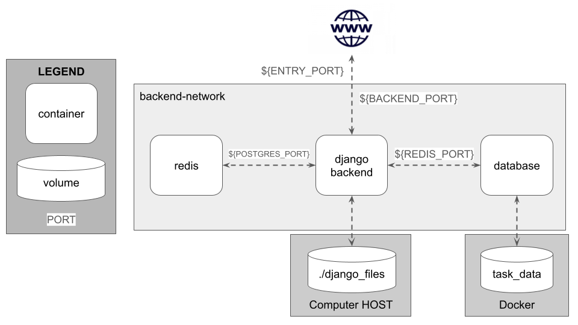

# Architecture

The system is composed by these Docker containers:
- `django_backend`: a container with a running instance of Django, Celery and Celery Beats. It has an anonymus volume linked to Django's files (`/django_backend`) to update automatically the files without restarting the container during development

- `redis`: a container running the Redis instance for Celery

- `database`: a container running the PostgreSQL database for Django's models. It has a volume associated for storing the database and give persistence to it

There is also a Docker network (`backend-network`) to connect the 3 containers with a port (`${BACKEND_PORT}`) mapped to `${ENTRY_POINT}` as the entrypoint for the whole system
